# ERD — Skema Inti (final)

> **Dibangkitkan otomatis** oleh `backend/migrations/erd_test.go` dari skema PostgreSQL yang benar-benar
> dihasilkan migrasi 001–033. **Jangan sunting manual.** Perbarui: `UPDATE_ERD=1 make db-test`.
> Penjelasan desain ada di [04-database-schema.md](04-database-schema.md); konsep di [03-database-erd.md](03-database-erd.md).
>
> Label relasi: kolom FK dan aksi `ON DELETE`. Relasi polimorfik tanpa FK (mis. `role_assignments.scope_id`,
> referensi lunak `activities`/`system_logs`) sengaja tidak digambar (04 §12). Tabel versi golang-migrate
> (`schema_migrations`) tidak ditampilkan.

```mermaid
erDiagram
    activities {
        uuid id PK
        uuid organization_id
        uuid actor_user_id
        varchar(30) actor_type
        varchar(150) action
        varchar(150) resource_type
        uuid resource_id
        varchar(30) scope_type
        uuid scope_id
        varchar(30) result
        inet ip_address
        text user_agent
        varchar(100) request_id
        varchar(100) trace_id
        jsonb metadata
        timestamptz created_at
    }
    attachments {
        uuid id PK
        uuid organization_id FK
        uuid owner_user_id FK
        uuid message_id FK
        varchar(50) storage_provider
        text storage_key
        varchar(255) original_name
        varchar(150) content_type
        bigint size_bytes
        varchar(128) checksum
        varchar(30) status
        timestamptz created_at
        timestamptz deleted_at
    }
    conversation_members {
        uuid id PK
        uuid conversation_id FK
        uuid organization_id FK
        uuid user_id FK
        varchar(30) member_role
        varchar(30) status
        timestamptz joined_at
        timestamptz left_at
        uuid last_read_message_id FK
        timestamptz muted_until
        timestamptz created_at
        timestamptz updated_at
    }
    conversations {
        uuid id PK
        uuid organization_id FK
        varchar(20) type
        varchar(255) title
        text direct_key
        uuid created_by FK
        varchar(30) status
        timestamptz created_at
        timestamptz updated_at
        timestamptz archived_at
    }
    credentials {
        uuid id PK
        uuid user_id FK
        varchar(30) credential_type
        text secret_hash
        jsonb metadata
        timestamptz created_at
        timestamptz updated_at
        timestamptz last_used_at
        timestamptz revoked_at
    }
    group_memberships {
        uuid id PK
        uuid group_id FK
        uuid organization_id FK
        uuid user_id FK
        varchar(30) status
        timestamptz joined_at
        uuid added_by FK
        timestamptz created_at
        timestamptz updated_at
    }
    groups {
        uuid id PK
        uuid organization_id FK
        uuid parent_group_id FK
        varchar(200) name
        varchar(100) slug
        text description
        varchar(30) status
        uuid created_by FK
        timestamptz created_at
        timestamptz updated_at
        timestamptz deleted_at
    }
    inbox_items {
        uuid id PK
        uuid organization_id FK
        uuid recipient_user_id FK
        varchar(100) type
        varchar(255) title
        text description
        jsonb data
        varchar(150) resource_type
        uuid resource_id
        text action_url
        varchar(30) status
        varchar(20) priority
        timestamptz created_at
        timestamptz completed_at
        timestamptz expires_at
    }
    invitations {
        uuid id PK
        uuid organization_id FK
        varchar(320) email
        uuid invited_by FK
        uuid group_id FK
        uuid role_id FK
        bytea token_hash
        varchar(30) status
        timestamptz expires_at
        timestamptz accepted_at
        timestamptz revoked_at
        timestamptz created_at
        timestamptz updated_at
    }
    message_reactions {
        uuid id PK
        uuid message_id FK
        uuid user_id FK
        varchar(50) reaction
        timestamptz created_at
    }
    message_reads {
        uuid id PK
        uuid message_id FK
        uuid user_id FK
        timestamptz read_at
    }
    messages {
        uuid id PK
        uuid conversation_id FK
        uuid sender_user_id FK
        varchar(30) message_type
        text body
        jsonb metadata
        uuid reply_to_message_id FK
        timestamptz created_at
        timestamptz updated_at
        timestamptz deleted_at
    }
    module_dependencies {
        uuid id PK
        uuid module_id FK
        uuid dependency_module_id FK
        varchar(100) version_constraint
        timestamptz created_at
    }
    module_installations {
        uuid id PK
        uuid organization_id FK
        uuid module_id FK
        varchar(50) version
        varchar(30) status
        jsonb configuration
        bigint row_version
        uuid installed_by FK
        timestamptz installed_at
        timestamptz enabled_at
        timestamptz disabled_at
        timestamptz updated_at
    }
    modules {
        uuid id PK
        varchar(100) code
        varchar(200) name
        varchar(50) version
        text description
        varchar(50) module_type
        varchar(30) status
        jsonb manifest
        timestamptz installed_at
        timestamptz enabled_at
        timestamptz disabled_at
        timestamptz created_at
        timestamptz updated_at
    }
    notifications {
        uuid id PK
        uuid organization_id FK
        uuid recipient_user_id FK
        varchar(100) type
        varchar(255) title
        text body
        jsonb data
        varchar(20) priority
        varchar(30) status
        timestamptz created_at
        timestamptz read_at
        timestamptz expires_at
    }
    organization_memberships {
        uuid id PK
        uuid organization_id FK
        uuid user_id FK
        varchar(30) status
        timestamptz joined_at
        uuid invited_by FK
        timestamptz created_at
        timestamptz updated_at
    }
    organizations {
        uuid id PK
        varchar(200) name
        varchar(100) slug
        varchar(255) legal_name
        varchar(30) status
        varchar(20) default_locale
        varchar(100) default_timezone
        timestamptz created_at
        timestamptz updated_at
        timestamptz deleted_at
    }
    outbox_events {
        uuid id PK
        uuid organization_id
        varchar(200) event_name
        varchar(100) aggregate_type
        uuid aggregate_id
        jsonb payload
        varchar(100) request_id
        varchar(100) trace_id
        varchar(20) status
        integer attempts
        timestamptz available_at
        text last_error
        timestamptz created_at
        timestamptz processed_at
    }
    password_reset_tokens {
        uuid id PK
        uuid user_id FK
        bytea token_hash
        timestamptz expires_at
        timestamptz used_at
        inet ip_address
        timestamptz created_at
    }
    permissions {
        uuid id PK
        uuid module_id FK
        varchar(150) resource
        varchar(100) action
        varchar(255) code
        text description
        boolean is_system
        timestamptz created_at
    }
    platforms {
        uuid id PK
        varchar(200) name
        varchar(100) installation_key
        varchar(50) version
        varchar(30) status
        timestamptz created_at
        timestamptz updated_at
    }
    policies {
        uuid id PK
        uuid organization_id FK
        varchar(150) name
        varchar(150) code
        text description
        varchar(20) effect
        text expression
        varchar(30) status
        timestamptz created_at
        timestamptz updated_at
    }
    role_assignments {
        uuid id PK
        uuid organization_id FK
        uuid role_id FK
        varchar(30) subject_type
        uuid subject_id
        varchar(30) scope_type
        uuid scope_id
        uuid assigned_by FK
        timestamptz expires_at
        timestamptz created_at
        timestamptz revoked_at
    }
    role_permissions {
        uuid id PK
        uuid role_id FK
        uuid permission_id FK
        uuid created_by FK
        timestamptz created_at
    }
    roles {
        uuid id PK
        uuid organization_id FK
        uuid group_id FK
        varchar(150) name
        varchar(100) slug
        text description
        varchar(30) role_type
        varchar(30) status
        timestamptz created_at
        timestamptz updated_at
    }
    security_events {
        uuid id PK
        uuid organization_id
        uuid user_id
        uuid session_id
        varchar(100) event_type
        varchar(30) result
        inet ip_address
        text user_agent
        varchar(100) request_id
        jsonb metadata
        timestamptz created_at
    }
    sessions {
        uuid id PK
        bytea token_hash
        uuid user_id FK
        uuid organization_id FK
        timestamptz created_at
        timestamptz last_activity_at
        timestamptz expires_at
        inet ip_address
        text user_agent
        varchar(30) auth_level
        timestamptz revoked_at
    }
    settings {
        uuid id PK
        varchar(30) scope_type
        uuid scope_id
        uuid module_id FK
        varchar(200) key
        jsonb value
        varchar(30) value_type
        boolean is_secret
        bigint row_version
        uuid created_by FK
        uuid updated_by FK
        timestamptz created_at
        timestamptz updated_at
    }
    system_logs {
        uuid id PK
        varchar(100) service
        varchar(50) environment
        varchar(20) level
        varchar(150) event_code
        text message
        varchar(100) request_id
        varchar(100) trace_id
        jsonb metadata
        timestamptz created_at
    }
    users {
        uuid id PK
        varchar(100) username
        varchar(200) display_name
        varchar(100) first_name
        varchar(100) last_name
        varchar(320) email
        varchar(50) phone
        text avatar_url
        varchar(20) locale
        varchar(100) timezone
        varchar(30) status
        timestamptz last_login_at
        timestamptz created_at
        timestamptz updated_at
        timestamptz deleted_at
    }

    messages |o--o{ attachments : "message_id [SET NULL]"
    organizations ||--o{ attachments : "organization_id [CASCADE]"
    users ||--o{ attachments : "owner_user_id [RESTRICT]"
    conversations ||--o{ conversation_members : "conversation_id, organization_id [CASCADE]"
    messages |o--o{ conversation_members : "last_read_message_id [SET NULL]"
    organization_memberships ||--o{ conversation_members : "organization_id, user_id [RESTRICT]"
    users ||--o{ conversations : "created_by [RESTRICT]"
    organizations ||--o{ conversations : "organization_id [CASCADE]"
    users ||--o{ credentials : "user_id [CASCADE]"
    groups ||--o{ group_memberships : "group_id, organization_id [CASCADE]"
    organization_memberships ||--o{ group_memberships : "organization_id, user_id [RESTRICT]"
    users |o--o{ group_memberships : "added_by [SET NULL]"
    users ||--o{ groups : "created_by [RESTRICT]"
    organizations ||--o{ groups : "organization_id [RESTRICT]"
    groups |o--o{ groups : "parent_group_id [RESTRICT]"
    organizations ||--o{ inbox_items : "organization_id [CASCADE]"
    users ||--o{ inbox_items : "recipient_user_id [CASCADE]"
    groups |o--o{ invitations : "group_id, organization_id [CASCADE]"
    users ||--o{ invitations : "invited_by [RESTRICT]"
    organizations ||--o{ invitations : "organization_id [CASCADE]"
    roles |o--o{ invitations : "role_id [RESTRICT]"
    messages ||--o{ message_reactions : "message_id [CASCADE]"
    users ||--o{ message_reactions : "user_id [CASCADE]"
    messages ||--o{ message_reads : "message_id [CASCADE]"
    users ||--o{ message_reads : "user_id [CASCADE]"
    conversations ||--o{ messages : "conversation_id [CASCADE]"
    messages |o--o{ messages : "reply_to_message_id [SET NULL]"
    users ||--o{ messages : "sender_user_id [RESTRICT]"
    modules ||--o{ module_dependencies : "dependency_module_id [RESTRICT]"
    modules ||--o{ module_dependencies : "module_id [CASCADE]"
    users ||--o{ module_installations : "installed_by [RESTRICT]"
    modules ||--o{ module_installations : "module_id [RESTRICT]"
    organizations ||--o{ module_installations : "organization_id [CASCADE]"
    organizations |o--o{ notifications : "organization_id [CASCADE]"
    users ||--o{ notifications : "recipient_user_id [CASCADE]"
    users |o--o{ organization_memberships : "invited_by [SET NULL]"
    organizations ||--o{ organization_memberships : "organization_id [RESTRICT]"
    users ||--o{ organization_memberships : "user_id [RESTRICT]"
    users ||--o{ password_reset_tokens : "user_id [CASCADE]"
    modules |o--o{ permissions : "module_id [RESTRICT]"
    organizations |o--o{ policies : "organization_id [CASCADE]"
    users |o--o{ role_assignments : "assigned_by [SET NULL]"
    organizations |o--o{ role_assignments : "organization_id [CASCADE]"
    roles ||--o{ role_assignments : "role_id [RESTRICT]"
    users |o--o{ role_permissions : "created_by [SET NULL]"
    permissions ||--o{ role_permissions : "permission_id [RESTRICT]"
    roles ||--o{ role_permissions : "role_id [CASCADE]"
    groups |o--o{ roles : "group_id, organization_id [RESTRICT]"
    organizations |o--o{ roles : "organization_id [CASCADE]"
    organizations |o--o{ sessions : "organization_id [CASCADE]"
    users ||--o{ sessions : "user_id [CASCADE]"
    users |o--o{ settings : "created_by [SET NULL]"
    modules |o--o{ settings : "module_id [CASCADE]"
    users |o--o{ settings : "updated_by [SET NULL]"
```

